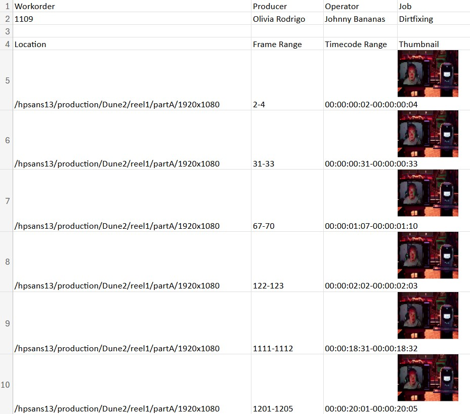

# The Crucible: Advanced Media Workflow

## Introduction
This project enhances media workflows by integrating functionalities for handling marked shots in a Content Management System (CMS). The aim is to improve visualization and review capabilities, enabling effective commentary on marked shots. It combines elements from Virtual Production (VP), Gaming, and Visual Effects (VFX).

## Problem Statement
### General Problem
Handling marked shots in a CMS for editorial and review purposes efficiently.

### Specific Problem
Providing tools to visualize and comment on marked shots effectively.

## Tools and References
- **CMS Companies**: Frame.io and ShotGrid
- **FFmpeg**: For media manipulation and timecode extraction.
  - [Installation Guide](https://ottverse.com/what-is-ffmpeg-installation-use-cases/)
  - [FFmpeg Commands for Beginners](https://ostechnix.com/20-ffmpeg-commands-beginners/)
  - [Timecode Extraction](https://ffmpeg.org/ffprobe.html)

## Workflow

1. **Command-Line Arguments**:
   - `--baselight` for Baselight file input.
   - `--xytech` for Xytech file input.

2. **Database Setup**:
   - Create two collections: Baselight (Folder/Frames) and Xytech (Workorder/Location).

3. **Process Video**:
   - Download the provided VP video: [Download Link](https://mycsun.box.com/s/v55rwqlu5ufuc8l510r8nni0dzq5qki7).
   - Use `--process` argument to handle the video file.

4. **Analyze Data**:
   - Query the database to find ranges matching the video length.

5. **Timecode Conversion**:
   - Extract timecodes using FFmpeg or a custom method.
   - Convert marks to timecode ranges.

6. **Generate Output**:
   - Use `--output` to export results to an XLS file.
   - Include a new column for timecode ranges and thumbnails.

7. **Create Thumbnails**:
   - Generate 96x74 thumbnails for each range.
   - Use the middle frame or closest equivalent.

8. **Render Shots and Upload**:
   - Render each shot using the extracted timecode.
   - Upload to Frame.io via their [API](https://developer.frame.io/api/reference/).

## Notes on Timecode
- **Frames per second**: 24fps.
- **Example Conversion**: 1000 frames = `00:00:41:16`.

## Output Screenshot

*Figure 1: Example output showcasing the XLS file with frame ranges and thumbnails.*

## Helpful Links
- [FFmpeg Documentation](https://ffmpeg.org/)
- [Box Video Link](https://mycsun.box.com/s/v55rwqlu5ufuc8l510r8nni0dzq5qki7)

## Conclusion
This project demonstrates practical experience with media workflows, enhancing the ability to manage marked shot data effectively in a CMS.

 
